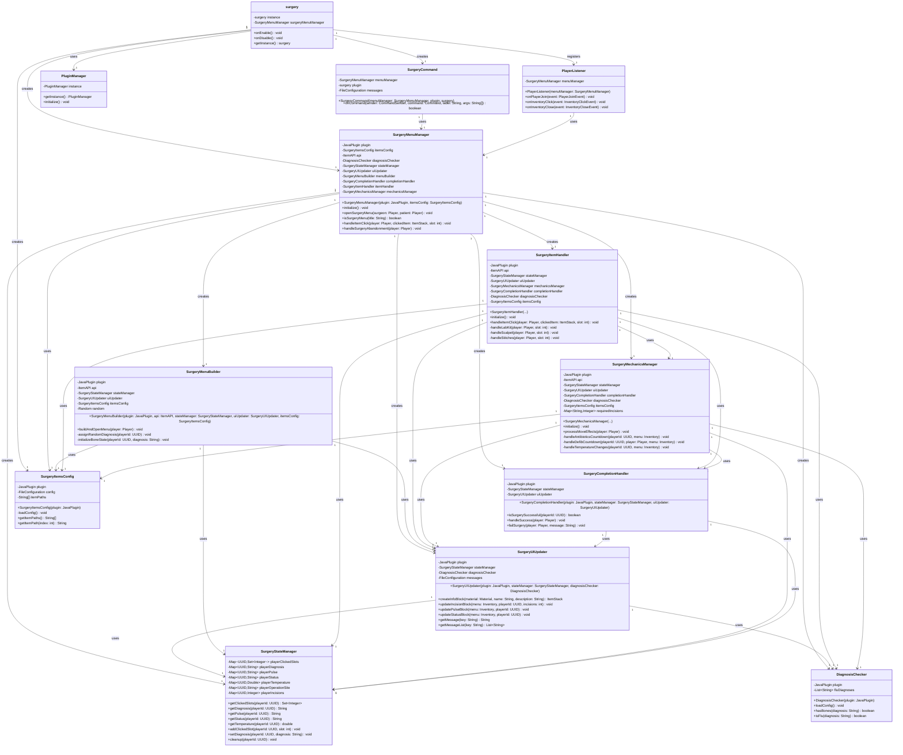

# Surgery

A Minecraft Paper plugin that adds a complex surgery simulation mini-game where surgeons perform operations on patients using custom surgical tools and managing various medical complications.

## Features

- Interactive surgery GUI system with visual status indicators
- 30+ diagnoses including injuries, infections, tumors, and mysterious ailments
- 14 different surgical tools with specific purposes
- Patient vitals: temperature, pulse, consciousness, and bleeding
- Skill-based mechanics with failure chances affected by patient condition
- Bone surgery system with broken and shattered bones
- Special diagnosis-specific mechanics (flu strains, chaos effects, etc.)
- Temperature management and infection control
- Defibrillator for cardiac arrest emergencies
- Time-pressure elements with death countdowns
- Customizable success/failure messages and console commands

## Architecture

The plugin follows a complex modular architecture with clear separation of concerns across multiple managers:



*View the [UML source file](UML-Diagram.mmd) for editing*

## Dependencies

| Dependency | Required |
|---|---|
| [Paper](https://papermc.io/) 1.21+ | Yes |
| [TLibs](https://www.spigotmc.org/resources/tlibs.127713/) | Yes |
| [MMOItems](https://www.spigotmc.org/resources/mmoitems-premium.39267/) | No |
| [ItemsAdder](https://itemsadder.com/) | No |

## Installation

1. Place `surgery.jar` into your server's `plugins/` folder
2. Restart the server or enable `surgery-1.0.0` with PlugManX
3. Configure `plugins/surgery/config.yml`, `messages.yml`, and `surgeryItemsConfig.yml` as needed
4. Make sure that players have access to surgical items

## Configuration

### surgeryItemsConfig.yml

Configure the TLibs item paths for all 14 surgery tools:

```yaml
items:
  sponge: "m.surgery.sponge"
  scalpel: "m.surgery.scalpel"
  stitches: "m.surgery.stitches"
  antibiotics: "m.surgery.antibiotics"
  antiseptic: "m.surgery.antiseptic"
  surgical-glove: "m.surgery.surgical_glove"
  ultrasound: "m.surgery.ultrasound"
  lab-kit: "m.surgery.lab_kit"
  anesthetic: "m.surgery.anesthetic"
  defibrillator: "m.surgery.defibrillator"
  pins: "m.surgery.pins"
  splint: "m.surgery.splint"
  clamp: "m.surgery.clamp"
  transfusion: "m.surgery.transfusion"

  # Vanilla item example: "v.iron_ingot"
  # ItemsAdder item example: "ia.tfmc:mythril_ingot"
```

### config.yml

```yaml
# Maximum distance between surgeon and patient
max-surgery-distance: 5.0

# List of 30+ possible diagnoses
diagnoses:
  - "Broken Heart"
  - "Lung Tumor"
  - "Appendicitis"
  - "Arcane Infection"
  # ... (see config for full list)

# Flu types that require specific temperature
flu-diagnoses:
  - "Bird Flu"
  - "Turtle Flu"
  - "Monkey Flu"

# Required incisions per diagnosis
required-incisions:
  "Nose Job": 1
  "Brain Tumor": 5
  "Appendicitis": 3
  # ... (configurable per diagnosis)

# Bone counts for bone-related diagnoses
bone-counts:
  "Broken Arm": { broken: 2, shattered: 0 }
  "Broken Leg": { broken: 2, shattered: 1 }
  "Broken Everything": { broken: 3, shattered: 2 }

# Skill fail chances
skill-fail:
  base-chance: 0.25              # 25% base fail rate
  bleeding-chance: 0.40          # 40% when bleeding
  with-sponge-chance: 0.10       # 10% after using sponge

# Temperature settings
temperature:
  normal: 98.6                   # Starting temp (°F)
  instant-death-threshold: 110.0 # Death above this
  red-temp-threshold: 106.0      # Danger zone
  success-threshold: 100.0       # Must be ≤ to succeed
  rise-rate: 1.8                 # Temp increase per move

# Death timers
death-timers:
  defibrillator-countdown: 2     # Moves until death after cardiac arrest
  weak-pulse-turns: 2            # Consecutive weak pulse turns
  red-temp-turns: 2              # Consecutive red temp turns
  anesthetic-reuse-cooldown: 4   # Cooldown between uses

# Commands executed on completion
commands:
  surgery-success: "sudo %surgeon% me Successfully treated %player%!"
  surgery-failure: "sudo %surgeon% me Failed surgery on %player%!"
```

### messages.yml

Contains all player-facing text including:
- Command messages and errors
- Success/failure notifications
- Tool-specific skill fail messages (14+ variants per tool)
- Status change alerts
- Diagnosis-specific events
- Progress updates

## Surgical Tools

| Tool | Purpose | Notes |
|---|---|---|
| **Ultrasound** | Diagnose patient | Assigns random diagnosis |
| **Lab Kit** | Check patient vitals | Shows temp, pulse, status, etc. |
| **Anesthetic** | Put patient to sleep | Required before cutting; has cooldown |
| **Scalpel** | Make incisions | Can cause bleeding/pulse drop |
| **Sponge** | Clear blood | Improves visibility; reduces fail chance |
| **Antiseptic** | Clean operation site | Prevents temperature rise |
| **Stitches** | Close incisions | Required before completion |
| **Antibiotics** | Control temperature | ±5.4°F random change |
| **Surgical Glove** | Fix the problem | Available after conditions met |
| **Defibrillator** | Restart heart | Available when heart stops |
| **Surgical Pins** | Fix broken bones | Available when bones discovered |
| **Surgical Splint** | Fix shattered bones | Available when shattered bones found |
| **Surgical Clamp** | Stop bleeding | Available when bleeding occurs |
| **Transfusion** | Restore pulse | Improves pulse by 1-2 levels |

## How to Perform Surgery

1. **Start Surgery**: Use `/surgery <player_name>` (patient must be within 5 blocks)
2. **Diagnose**: Use **Ultrasound** to identify the condition
3. **Anesthetize**: Use **Anesthetic** to put patient to sleep
4. **Check Vitals**: Use **Lab Kit** to monitor temperature, pulse, bleeding, etc.
5. **Make Incisions**: Use **Scalpel** to reach required incision count
6. **Manage Complications**:
   - Use **Sponge** if bleeding obscures vision
   - Use **Surgical Clamp** to stop severe bleeding
   - Use **Antiseptic** to prevent infection
   - Use **Antibiotics** to control fever
   - Use **Transfusion** for weak pulse
   - Use **Defibrillator** if heart stops
7. **Handle Bones** (if applicable):
   - Use **Surgical Pins** for broken bones
   - Use **Surgical Splint** for shattered bones
8. **Fix Problem**: Use **Surgical Glove** when all conditions are met
9. **Close Up**: Use **Stitches** to close all incisions
10. **Complete**: Click the **Finish Surgery** button

## Failure Conditions

-  Patient dies from hyperthermia (temp > 110°F)
-  Patient not resuscitated in time (cardiac arrest countdown)
-  Consecutive turns with extremely weak pulse
-  Patient bleeds out
-  Cutting while patient is awake

## Special Diagnosis Mechanics

| Diagnosis | Special Mechanic |
|---|---|
| **Flu strains** | Temperature must be exactly 98.6°F to use Surgical Glove |
| **Moldy Guts** | Forced bleeding every 3-4 moves |
| **Fatty Liver** | 20% chance heart stops when unconscious |
| **Broken Heart** | 35% chance heart stops when unconscious |
| **Arcane Infection** | 25% chaos chance: random temp spikes/drops, status changes |
| **Lupus** | 15% chance patient howls (causes incision + bleeding) |
| **Paper Cuts** | Requires 2 scalpel uses to examine wounds |

## Status Indicators

The surgery GUI uses colored concrete blocks to represent patient status:

| Status | Description | Color |
|---|---|---|
| **Patient Status** | Awake / Unconscious / Heart Stopped / Coming to | Yellow / Lime / Red / Orange |
| **Pulse** | Strong / Steady / Weak / Extremely Weak | Lime / Yellow / Orange / Red |
| **Temperature** | ≤100 / 101-104 / 105-106 / 107+ | Lime / Yellow / Orange / Red |
| **Operation Site** | Clean / Not sanitized / Unclean / Unsanitary | Lime / Yellow / Orange / Red |

## Commands

| Command | Permission | Description |
|---|---|---|
| `/surgery <player>` | (default) | Open surgery menu for specified patient |

## Usage Tips

- Always check vitals with Lab Kit before each action
- Keep the operation site clean with Antiseptic to prevent temperature rise
- Use Sponge immediately when bleeding occurs to reduce skill fail chance
- Monitor temperature closely. It rises with each move (except when site is clean)
- Have Defibrillator ready when pulse weakens
- For bone diagnoses, use Scalpel to reveal bones before repairing
- Flu diagnoses are tricky. Temperature must be exactly 98.6°F to fix

## Author

Justin - TFMC
[Donation Link](https://www.patreon.com/c/TFMCRP)
